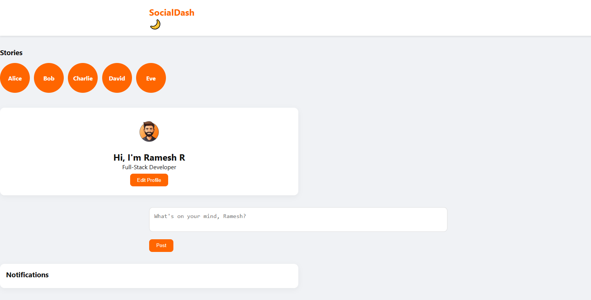

# Mini Social Media Dashboard

A modern mini social media dashboard built for **Ramesh R** where users can:

- Create, like, and delete posts
- Edit profile details (name, bio)
- View stories (Instagram/Facebook style carousel)
- Receive notifications for actions
- Toggle between Dark and Light mode
- Responsive design for all devices

## Features

- Interactive posts feed with localStorage persistence
- Dynamic stories carousel
- Notifications panel showing actions
- Dark/Light mode toggle
- Personalized with Ramesh’s name
- Modern, clean, and responsive UI

## Tech Stack

- HTML
- CSS
- JavaScript
- localStorage for persistence
  
## 📸 Screenshots


## How to Use

1. Clone the repository:
   ```bash
   git clone https://github.com/ramesh-852000/mini-social-dashboard.git
